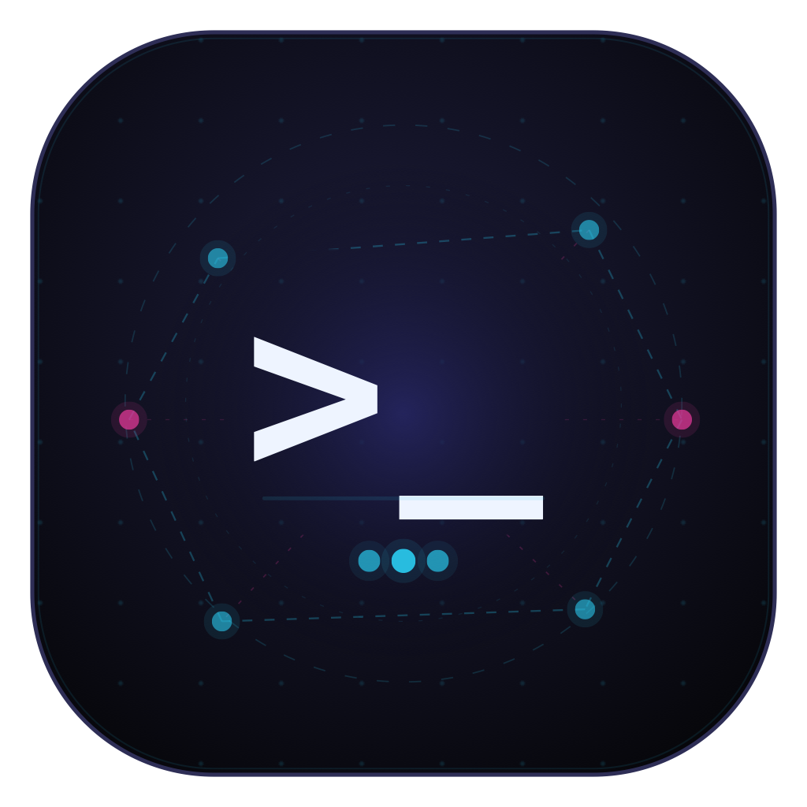
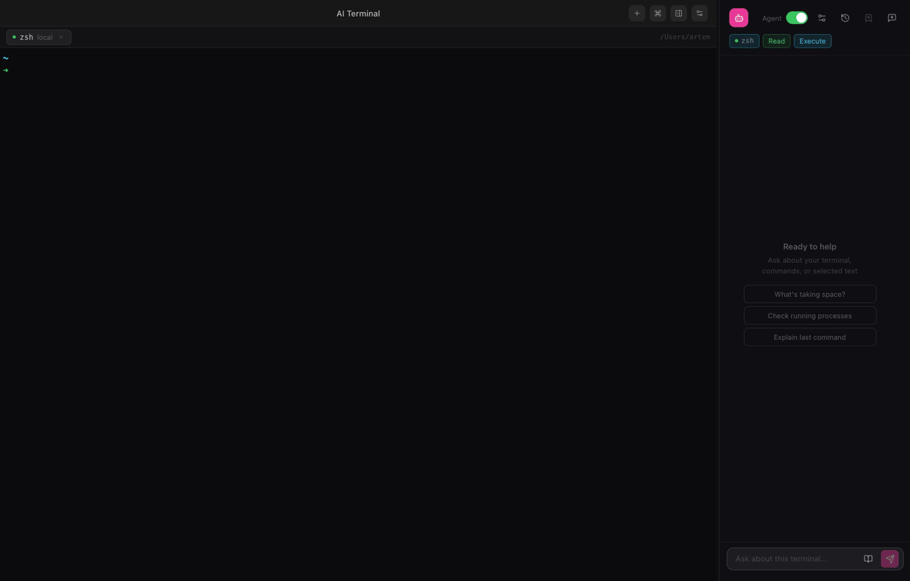

# AI Terminal

<p align="center">
  
</p>

<p align="center">
  <strong>A safer AI terminal for local and SSH workflows.</strong>
  <br>
  Ask what happened, get the next command, and keep control before anything risky runs.
</p>

<p align="center">
  
  
  
  
  
</p>

<p align="center">
  
</p>

## What it is

AI Terminal is a local-first macOS terminal with an AI assistant built in. It understands your shell output, works with local and SSH sessions, supports OpenAI-compatible providers, Ollama, and LM Studio, and pauses before risky commands touch your shell.

Use it as a normal terminal, then switch the assistant between read-only help and agent mode when you want it to propose and run commands step by step. The terminal stays in front: real local shells, SSH through your system `ssh`, searchable output, clickable links, tabs, themes, and a compact assistant sidebar.

## Core workflows

- **Explain failing output** — select text, use recent output, or share the current session so the assistant can explain errors and logs without leaving the terminal.
- **Get a safe next command** — ask for one next step, review what it does, and keep the final approval before risky or unclear commands run.
- **Troubleshoot SSH sessions** — diagnose remote shells with the same context flow, while agent mode still routes risky commands through an in-app safety gate.

## Highlights

- **Real terminal sessions** — local PTY tabs plus SSH profiles that use your existing config, keys, agents, and jump hosts.
- **Context-aware assistant** — ask about selected text, recent output, the current session, or what command should come next.
- **Agent mode with safety checks** — commands run one at a time, with a dedicated risk model and confirmation modal for dangerous steps.
- **Provider choice** — connect OpenAI-compatible APIs, Ollama, or LM Studio, with separate chat and command-risk models.
- **Prompt and command libraries** — save reusable prompts, turn chats into prompts, and keep command snippets close to the terminal.
- **Personal workspace** — restore sessions, reopen chat history, tune themes and font size, change language, and import or export settings.
- **macOS-native storage** — non-secret settings live in app data, while API keys stay in the system keychain.

## Security and privacy

- API keys are stored in the macOS Keychain through `keytar`, not in project config files.
- Non-secret provider settings, prompts, and app configuration are stored locally in app data.
- You choose which provider receives assistant context: OpenAI-compatible APIs, Ollama, or LM Studio.
- The assistant only receives the context mode you select, such as selected text, recent output, or the current session.
- Agent mode asks a dedicated command-risk model before auto-execution.
- If command-risk classification fails or cannot be parsed, the command is treated as risky and requires confirmation.
- Risky or unclear commands pause in an in-app confirmation modal before they touch your shell.

## Getting started

### Download

Grab the latest `.zip` from [Releases](https://github.com/Doka-NT/ai-terminal/releases), unzip it, and drag **AI Terminal.app** to your Applications folder.

Current release builds are unsigned. macOS will warn that the app is from an unidentified developer.

> **First launch:** right-click **AI Terminal.app** → **Open** → **Open** to proceed.
> Or run: `xattr -dr com.apple.quarantine "/Applications/AI Terminal.app"`

Release assets include a `checksums.txt` file when built by GitHub Actions.

### Build from source

```bash
git clone https://github.com/Doka-NT/ai-terminal.git
cd ai-terminal
make build
```

Open `dist/`, unzip the archive or run the package, and drag **AI Terminal.app** to your Applications folder when needed.

On first launch, go to **Settings → Providers** and add your API key and base URL. Then pick a model and start a session.

---

## Development

**Run locally:**

```bash
npm install
npm run dev
```

**Checks:**

```bash
npm run lint
npm run typecheck
npm test
```

**Build macOS package:**

```bash
make build
# Output: dist/*.pkg and dist/*.zip (unsigned)
```

## License

AI Terminal source code is licensed under the
[GNU Affero General Public License v3.0 or later](LICENSE).

Copyright (C) 2026 Soshnikov Artem.

The AI Terminal name, logo, icon, and other branding assets are not licensed
for use as trademarks or to imply endorsement. Forks and redistributed builds
should use their own name and branding unless they have written permission.
